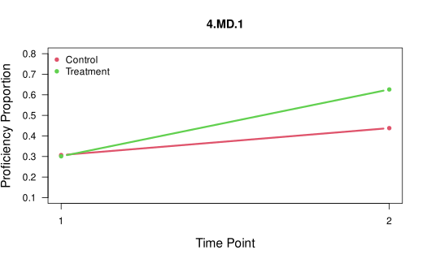
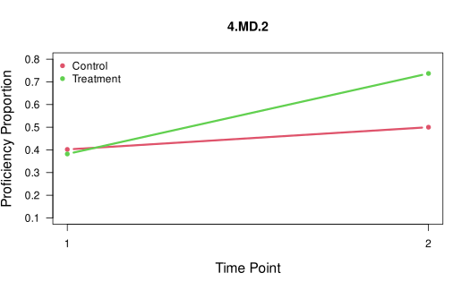
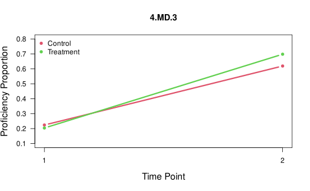
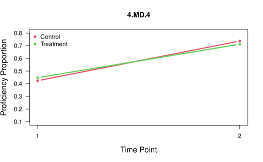
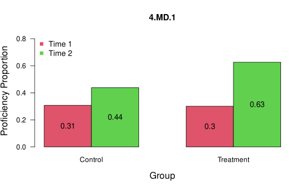
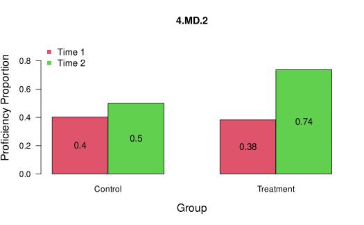
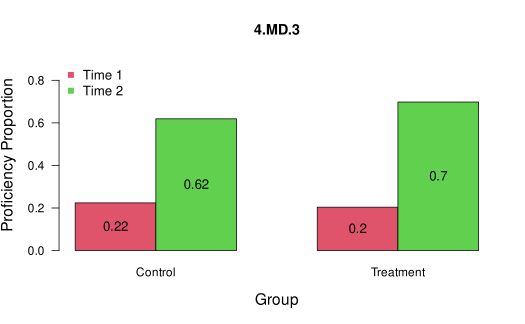
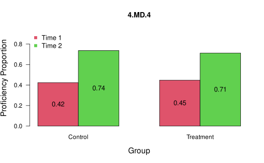

# Introduction to the TDCM Package

## Overview of the TDCM Package

The **TDCM** R package implements estimation of longitudinal diagnostic
classification models (DCMs) using the transition diagnostic
classification model (TDCM) framework described in [Madison & Bradshaw
(2018)](https://doi.org/10.1007/s11336-018-9638-5). The TDCM is a
longitudinal extension of the log-linear cognitive diagnosis model
(LCDM) developed by [Henson, Templin & Willse
(2009)](https://doi.org/10.1007/s11336-008-9089-5). As the LCDM is a
general DCM, many other DCMs can be embedded within TDCM.

The **TDCM** package includes functions to estimate the single group
([`TDCM::tdcm()`](https://cotterell.github.io/tdcm/reference/tdcm.md))
and multigroup
([`TDCM::mg.tdcm()`](https://cotterell.github.io/tdcm/reference/mg.tdcm.md))
TDCM and summarize results of interest, including: item parameter
estimates, growth proportions, transition probabilities, transition
reliability, attribute correlations, model fit, and growth plots.
Internally, the **TDCM** package uses
[`CDM::gdina()`](https://rdrr.io/pkg/CDM/man/gdina.html) from the
**CDM** package developed by [Robitzsch et
al. (2022)](https://doi.org/10.18637/jss.v074.i02) to estimate TDCMs
using a method described in [Madison et
al. (2024)](https://doi.org/10.1007/s41237-023-00202-5).

This vignette provides an overview of the package’s core functionality
by walking through two examples. The code below can be copied into the R
console and run. For more detailed video demonstrations of the package
and its functionality, visit Matthew J. Madison’s [Logitudinal DCMs
page](https://matthewmadison.com/research).

## Core Functionalities

- To estimate the single group and multigroup TDCM, use the
  [`TDCM::tdcm()`](https://cotterell.github.io/tdcm/reference/tdcm.md)
  and
  [`TDCM::mg.tdcm()`](https://cotterell.github.io/tdcm/reference/mg.tdcm.md)
  functions, respectively.

- To extract item, person, and growth parameters from TDCM estimates,
  use the
  [`TDCM::tdcm.summary()`](https://cotterell.github.io/tdcm/reference/tdcm.summary.md)
  and
  [`TDCM::mg.tdcm.summary()`](https://cotterell.github.io/tdcm/reference/mg.tdcm.summary.md)
  functions for single group and multigroup analyses, respectively.
  These summary functions produce a list of results that include: item
  parameter estimates, growth proportions and effect sizes, transition
  probability matrices, transition reliability, attribute correlations,
  and model fit.

- To compare models and assess relative fit, use the
  [`TDCM::tdcm.compare()`](https://cotterell.github.io/tdcm/reference/tdcm.compare.md)
  function.

- To plot the results of a TDCM analysis, use the
  [`TDCM::tdcm.plot()`](https://cotterell.github.io/tdcm/reference/tdcm.plot.md)
  function.

- To score responses using fixed item parameters from a previously
  calibrated model, use the
  [`TDCM::tdcm.score()`](https://cotterell.github.io/tdcm/reference/tdcm.score.md)
  function.

## Extended Functionalities

- Different DCMs (e.g., LCDM, DINA, CRUM, GDINA) can be modeled using
  the
  [`TDCM::tdcm()`](https://cotterell.github.io/tdcm/reference/tdcm.md)
  function by supplying an argument for its `rule` and `linkfct`
  parameters. For DCM `rule` specification, the package currently
  accepts “LCDM” (default), “DINA”, “DINO”, “CRUM”, “RRUM”, “LCDM2” for
  the LCDM with up to two-way interactions, “LCDM3” for the LCDM with up
  to three-way interactions, and so on. Different link functions can be
  specified in the `linkfct` parameter, including “logit” (default),
  “identity” to obtain the GDINA model, and “log”.

- Using multiple Q-matrices for each time is supported by the
  [`TDCM::tdcm()`](https://cotterell.github.io/tdcm/reference/tdcm.md)
  function. To enable this functionality, an argument \>= 2 must be
  supplies for its `num.q.matrix` parameter, and an appropriately
  stacked Q-matrix must be supplied for its `q.matrix` parameter.

- Anchor (common) items between time points can be specified with the
  `anchor` parameter.

- A reduced transition space can be implemented with the `forget.att`
  argument, where attribute proficiency loss, or forgetting, can be
  constrained for individual attributes.

- For more than two time points, transitions can be defined differently
  (e.g., first-to-last, first-to-each, successive) with the
  `transition.option` parameter.

- Responses can be scored using fixed item parameters from a previously
  calibrated model using the
  [`TDCM::tdcm.score()`](https://cotterell.github.io/tdcm/reference/tdcm.score.md)
  function.

## Example 1: Single Group TDCM

Suppose we have a sample of 1000 fourth grade students. They were
assessed before and after a unit covering 4 measurement and data (MD)
standards (attributes):

``` r
standards <- paste0("4.MD.", 1:4)
standards
```

    [1] "4.MD.1" "4.MD.2" "4.MD.3" "4.MD.4"

The students took the same 20-item assessment, five weeks apart. The
goal is to examine how the students transition to proficiency of the
four assessed attributes.

### Step 1: Load the Package and Sample Dataset

``` r
# Load the TDCM package and sample dataset
library(TDCM)
data(data.tdcm01, package = "TDCM")

# Get item responses from sample data.
data <- data.tdcm01$data
head(data)
```

      t1tem1 t1tem2 t1tem3 t1tem4 t1tem5 t1tem6 t1tem7 t1tem8 t1tem9 t1tem10
    1      0      0      1      0      0      0      1      0      0       1
    2      0      1      1      0      1      0      0      0      0       1
    3      0      0      0      1      1      1      0      1      0       1
    4      1      0      0      0      0      0      0      0      0       0
    5      1      0      0      0      0      0      0      0      0       0
    6      0      0      0      0      0      0      1      0      1       0
      t1tem11 t1tem12 t1tem13 t1tem14 t1tem15 t1tem16 t1tem17 t1tem18 t1tem19
    1       0       0       0       1       0       1       0       1       0
    2       1       1       1       1       1       1       0       1       0
    3       1       0       0       1       0       0       1       1       0
    4       0       0       0       0       0       0       0       0       0
    5       0       1       0       1       0       1       0       1       0
    6       1       0       0       0       0       0       0       0       0
      t1tem20 t2item1 t2item2 t2item3 t2item4 t2item5 t2item6 t2item7 t2item8
    1       1       0       1       1       1       1       0       0       0
    2       0       0       0       0       0       0       0       0       0
    3       1       0       0       1       0       1       0       1       1
    4       0       0       0       0       0       0       1       0       1
    5       0       0       1       0       0       1       1       1       1
    6       1       0       0       0       0       0       0       0       0
      t2item9 t2item10 t2item11 t2item12 t2item13 t2item14 t2item15 t2item16
    1       0        0        0        1        0        1        1        0
    2       0        1        0        0        0        1        0        1
    3       1        1        1        1        1        0        1        0
    4       1        0        1        1        1        1        1        1
    5       1        1        1        0        1        1        0        1
    6       1        0        1        1        1        1        1        1
      t2item17 t2item18 t2item19 t2item20
    1        1        0        1        0
    2        1        0        1        0
    3        0        0        0        0
    4        1        1        1        1
    5        1        1        0        1
    6        1        1        0        0

``` r
# Get Q-matrix from sample data and rename the attributes to match the standard.
q.matrix <- data.tdcm01$q.matrix
colnames(q.matrix) <- standards
q.matrix
```

           4.MD.1 4.MD.2 4.MD.3 4.MD.4
    Item1       1      0      0      0
    Item2       1      0      0      0
    Item3       1      0      0      0
    Item4       1      1      0      0
    Item5       1      0      1      0
    Item6       0      1      0      0
    Item7       0      1      0      0
    Item8       0      1      0      0
    Item9       0      1      1      0
    Item10      0      1      0      1
    Item11      0      0      1      0
    Item12      0      0      1      0
    Item13      0      0      1      0
    Item14      0      0      1      1
    Item15      1      0      1      0
    Item16      0      0      0      1
    Item17      0      0      0      1
    Item18      0      0      0      1
    Item19      1      0      0      1
    Item20      0      1      0      1

### Step 2: Estimate the TDCM

To estimate the TDCM, let’s make some decisions. The Q-matrix has some
complex items measuring 2 attributes, so we initially estimate the full
LCDM with two-way interactions (default). Since the students took the
same assessment, we can assume measurement invariance and will test the
assumption later.

``` r
# Calibrate TDCM with measurement invariance assumed, full LCDM
model1 <- tdcm(data, q.matrix, num.time.points = 2)
```

    [1] Preparing data for tdcm()...
    [1] Estimating the TDCM in tdcm()...
    [1] Depending on model complexity, estimation time may vary...
    [1] TDCM estimation complete.
    [1] Use tdcm.summary() to display results.

### Step 3: Summarize the Results

To summarize results, use the
[`TDCM::tdcm.summary()`](https://cotterell.github.io/tdcm/reference/tdcm.summary.md)function.
After running the summary function, we can examine item parameters,
growth in attribute proficiency, transition probability matrices,
individual transitions, and transitional reliability estimates.

``` r
# Summarize the results
results1 <- tdcm.summary(model1, attribute.names = standards)
```

    [1] Summarizing results...
    [1] Routine finished. Check results.

To demonstrate interpretation, let’s discuss some of the results.

``` r
item.parameters <- results1$item.parameters
item.parameters
```

            λ0     λ1,1  λ1,2  λ1,3  λ1,4  λ2,12 λ2,13 λ2,14 λ2,23 λ2,24  λ2,34
    Item 1  -1.905 2.599   --    --    --    --    --    --    --    --     -- 
    Item 2  -2.072 2.536   --    --    --    --    --    --    --    --     -- 
    Item 3  -1.934 2.517   --    --    --    --    --    --    --    --     -- 
    Item 4  -1.892 1.091 1.499   --    --  1.057   --    --    --    --     -- 
    Item 5  -2.17  1.456   --  1.794   --    --  1.018   --    --    --     -- 
    Item 6  -1.843   --  2.199   --    --    --    --    --    --    --     -- 
    Item 7  -1.825   --  2.259   --    --    --    --    --    --    --     -- 
    Item 8  -1.967   --  2.497   --    --    --    --    --    --    --     -- 
    Item 9  -2.009   --  1.079 1.511   --    --    --    --  1.818   --     -- 
    Item 10 -2       --  1.849   --  1.324   --    --    --    --  1.065    -- 
    Item 11 -1.845   --    --  2.329   --    --    --    --    --    --     -- 
    Item 12 -2.033   --    --  2.539   --    --    --    --    --    --     -- 
    Item 13 -2.071   --    --  2.55    --    --    --    --    --    --     -- 
    Item 14 -2.093   --    --  1.739 2.031   --    --    --    --    --   0.496
    Item 15 -1.785 0.307   --  1.295   --    --  2.374   --    --    --     -- 
    Item 16 -2.218   --    --    --  2.837   --    --    --    --    --     -- 
    Item 17 -2.084   --    --    --  2.69    --    --    --    --    --     -- 
    Item 18 -2.101   --    --    --  2.521   --    --    --    --    --     -- 
    Item 19 -2.1   2.653   --    --  1.432   --    --  0.098   --    --     -- 
    Item 20 -2.061   --  2.545   --  1.53    --    --    --    --  -0.005   -- 

Item 1 measuring `4.MD.1` has an intercept estimate of -1.905 and a main
effect estimate of -2.072.

``` r
growth <- results1$growth
growth
```

           T1[1] T2[1]
    4.MD.1 0.190 0.370
    4.MD.2 0.317 0.491
    4.MD.3 0.392 0.579
    4.MD.4 0.242 0.693

With respect to growth, we see that students exhibited about the same
amount of growth for `4.MD.1`, `4.MD.2`, and `4.MD.3` (about 18.03%
growth in proficiency), but showed larger gains for `4.MD.4` (about
45.1%).

``` r
transition.probabilities <- results1$transition.probabilities
transition.probabilities
```

    , , 4.MD.1: Time 1 to Time 2

           T2 [0] T2 [1]
    T1 [0]  0.680  0.320
    T1 [1]  0.417  0.583

    , , 4.MD.2: Time 1 to Time 2

           T2 [0] T2 [1]
    T1 [0]  0.581  0.419
    T1 [1]  0.353  0.647

    , , 4.MD.3: Time 1 to Time 2

           T2 [0] T2 [1]
    T1 [0]  0.549  0.451
    T1 [1]  0.221  0.779

    , , 4.MD.4: Time 1 to Time 2

           T2 [0] T2 [1]
    T1 [0]  0.371  0.629
    T1 [1]  0.104  0.896

Examining the `4.MD.1` transition probability matrix, we see that of the
students who started in non-proficiency, 32% of them transitioned into
proficiency.

``` r
transition.posteriors <- results1$transition.posteriors
head(transition.posteriors)
```

    , , 4.MD.1: T1 to T2

         00    01    10    11
    1 0.000 0.999 0.000 0.000
    2 0.092 0.000 0.908 0.000
    3 0.988 0.007 0.005 0.001
    4 0.943 0.038 0.019 0.000
    5 0.975 0.014 0.011 0.000
    6 0.995 0.004 0.000 0.000

    , , 4.MD.2: T1 to T2

         00    01    10    11
    1 0.068 0.000 0.928 0.004
    2 0.988 0.007 0.005 0.000
    3 0.000 0.001 0.001 0.998
    4 0.100 0.899 0.000 0.002
    5 0.000 0.999 0.000 0.001
    6 0.454 0.003 0.540 0.003

    , , 4.MD.3: T1 to T2

         00    01    10    11
    1 0.002 0.985 0.000 0.013
    2 0.000 0.000 0.995 0.005
    3 0.000 0.971 0.000 0.029
    4 0.001 0.993 0.000 0.007
    5 0.000 0.868 0.001 0.131
    6 0.001 0.556 0.001 0.443

    , , 4.MD.4: T1 to T2

         00    01    10    11
    1 0.000 0.015 0.063 0.922
    2 0.000 0.049 0.001 0.950
    3 0.001 0.000 0.967 0.031
    4 0.001 0.996 0.000 0.004
    5 0.000 0.157 0.000 0.843
    6 0.003 0.997 0.000 0.000

Examining the individual transition posterior probabilities, we see that
Examinee 1 has a mostly likely transition of 0 → 1 (0.999 probability).

``` r
results1$reliability
```

           pt bis info gain polychor ave max tr P(t>.6) P(t>.7) P(t>.8) P(t>.9)
    4.MD.1  0.821     0.516    0.936      0.931   0.966   0.927   0.861   0.790
    4.MD.2  0.792     0.552    0.916      0.908   0.939   0.893   0.839   0.731
    4.MD.3  0.770     0.540    0.922      0.895   0.943   0.870   0.796   0.674
    4.MD.4  0.771     0.494    0.914      0.913   0.952   0.894   0.829   0.748
           wt pt bis wt info gain
    4.MD.1     0.834        0.601
    4.MD.2     0.809        0.591
    4.MD.3     0.786        0.584
    4.MD.4     0.798        0.602

Finally, transition reliability appears adequate, with average maximum
transition posteriors ranging from .88 to .92 for the four attributes.

### Step 4: Assess Measurement Invariance

To assess measurement invariance, let’s estimate a model without
invariance assumed, then compare to our first model. Here we see that
AIC, BIC, and the likelihood ratio test prefer the model with invariance
assumed. Therefore, item parameter invariance is a reasonable assumption
and we can interpret results.

``` r
# Estimate TDCM with measurement invariance not assumed.
model2 <- tdcm(data, q.matrix, num.time.points = 2, invariance = FALSE)
```

    [1] Preparing data for tdcm()...
    [1] Estimating the TDCM in tdcm()...
    [1] Depending on model complexity, estimation time may vary...
    [1] TDCM estimation complete.
    [1] Use tdcm.summary() to display results.

``` r
# Compare Model 1 (longitudinal invariance assumed) to Model 2 (invariance not assumed).
tdcm.compare(model1, model2)
```

       Model   loglike Deviance Npars      AIC      BIC Chisq df      p
    1 model1 -21369.72 42739.44   311 43361.44 44887.75 64.68 56 0.1995
    2 model2 -21337.38 42674.75   367 43408.75  45209.9    NA NA     NA

### Step 5: Estimate other DCMs

To estimate other DCMs, change the `rule` argument. To specify one DCM
across all items, include one specification. To specify a different DCM
on each item, use a vector with length equal to the number of items.
Here, we specify a DINA measurement model and a main effects model
(ACDM). Here, we see that the full LCDM fits better than the DINA model
and the main effects model.

``` r
# calibrate TDCM with measurement invariance assumed, DINA measurement model
model3 <- tdcm(data, q.matrix, num.time.points = 2, rule = "DINA")
```

    [1] Preparing data for tdcm()...
    [1] Estimating the TDCM in tdcm()...
    [1] Depending on model complexity, estimation time may vary...
    [1] TDCM estimation complete.
    [1] Use tdcm.summary() to display results.

``` r
#calibrate TDCM with measurement invariance assumed, ACDM measurement model
model4 <- tdcm(data, q.matrix, num.time.points = 2, rule = "CRUM")
```

    [1] Preparing data for tdcm()...
    [1] Estimating the TDCM in tdcm()...
    [1] Depending on model complexity, estimation time may vary...
    [1] TDCM estimation complete.
    [1] Use tdcm.summary() to display results.

``` r
#compare Model 1 (full LCDM) to Model 3 (DINA)
tdcm.compare(model1, model3)
```

       Model   loglike Deviance Npars      AIC      BIC  Chisq df  p
    1 model1 -21369.72 42739.44   311 43361.44 44887.75 502.22 16  0
    2 model3 -21620.83 43241.67   295 43831.67 45279.46     NA NA NA

``` r
#compare Model 1 (full LCDM) to Model 4 (CRUM)
tdcm.compare(model1, model4)
```

       Model   loglike Deviance Npars      AIC      BIC Chisq df  p
    1 model1 -21369.72 42739.44   311 43361.44 44887.75  60.3  8  0
    2 model4 -21399.87 42799.74   303 43405.74 44892.79    NA NA NA

### Step 6: Assess Absolute Fit

To assess absolute fit, extract model fit statistics from the results
summary.

``` r
results1$model.fit$Global.Fit.Stats
```

                           est
    MADcor          0.02257097
    SRMSR           0.02834149
    100*MADRESIDCOV 0.49363470
    MADQ3           0.03199369
    MADaQ3          0.03081550

``` r
results1$model.fit$Global.Fit.Tests
```

           type       value         p
    1   max(X2) 10.06542439 1.0000000
    2 abs(fcor)  0.09731844 0.8268709

``` r
results1$model.fit$Global.Fit.Stats2
```

         maxX2 p_maxX2     MADcor      SRMSR 100*MADRESIDCOV      MADQ3    MADaQ3
    1 10.06542       1 0.02257097 0.02834149       0.4936347 0.03199369 0.0308155

``` r
results1$model.fit$Item.RMSEA
```

        Item 1     Item 2     Item 3     Item 4     Item 5     Item 6     Item 7 
    0.09391612 0.12079524 0.10670311 0.10952611 0.11962801 0.13655715 0.13845978 
        Item 8     Item 9    Item 10    Item 11    Item 12    Item 13    Item 14 
    0.10811876 0.11353405 0.11115225 0.12981641 0.11323978 0.10265758 0.11435661 
       Item 15    Item 16    Item 17    Item 18    Item 19    Item 20    Item 21 
    0.12122112 0.12147005 0.10578848 0.11120378 0.09767873 0.13304620 0.10788168 
       Item 22    Item 23    Item 24    Item 25    Item 26    Item 27    Item 28 
    0.10949474 0.11713454 0.12149082 0.11334556 0.12767058 0.12317678 0.10590232 
       Item 29    Item 30    Item 31    Item 32    Item 33    Item 34    Item 35 
    0.11158355 0.11326936 0.11504822 0.11948474 0.11920146 0.09564141 0.12998822 
       Item 36    Item 37    Item 38    Item 39    Item 40 
    0.11363849 0.12522381 0.11581421 0.10939110 0.11244670 

``` r
results1$model.fit$Mean.Item.RMSEA
```

    [1] 0.1153924

### Step 7: Visualize

For a visual presentation of results, run the
[`tdcm.plot()`](https://cotterell.github.io/tdcm/reference/tdcm.plot.md)
function:

``` r
# plot results (check plot viewer for line plot and bar chart)
tdcm.plot(results1, attribute.names = standards)
```

## Example 2: Multigroup TDCM

Suppose now that we have a sample of 1700 fourth grade students. But in
this example, researchers wanted to evaluate the effects of an
instructional intervention. So they randomly assigned students to either
the control group (Group 1, N1 = 800) or the treatment group (Group 2,
N2 = 900). The goal was to see if the innovative instructional method
resulted in more students transitioning into proficiency.

Similar to Example \#1, students were assessed before and after a unit
covering four measurement and data (MD) standards (attributes; 4.MD.1 -
4.MD.4). The students took the same 20-item assessment five weeks apart.

**Step 1:** Load the package and Dataset \#4 included in the package:

``` r
#load the TDCM library
library(TDCM)

#read data, Q-matrix, and group labels
dat4 <- data.tdcm04$data
qmat4 <- data.tdcm04$q.matrix
groups <- data.tdcm04$groups
head(dat4)
```

      t1item1 t1item2 t1item3 t1item4 t1item5 t1item6 t1item7 t1item8 t1item9
    1       0       0       0       0       0       0       0       0       0
    2       0       0       0       0       0       0       0       0       0
    3       0       1       0       0       0       0       0       1       0
    4       0       0       0       1       0       0       0       0       0
    5       1       0       0       1       1       0       1       1       1
    6       1       1       1       0       1       0       1       1       0
      t1item10 t1item11 t1item12 t1item13 t1item14 t1item15 t1item16 t1item17
    1        0        0        0        0        0        0        0        0
    2        1        0        0        0        0        0        0        0
    3        0        0        0        1        0        0        0        0
    4        0        1        0        0        0        0        1        1
    5        0        0        0        0        0        0        0        0
    6        1        0        1        1        1        1        1        0
      t1item18 t1item19 t1item20 t2item1 t2item2 t2item3 t2item4 t2item5 t2item6
    1        0        0        0       0       0       1       1       0       0
    2        0        0        0       0       1       1       0       0       1
    3        0        0        0       0       0       1       0       0       0
    4        0        0        0       0       1       1       1       1       0
    5        1        0        0       0       0       1       1       0       0
    6        1        1        1       0       0       0       0       0       1
      t2item7 t2item8 t2item9 t2item10 t2item11 t2item12 t2item13 t2item14 t2item15
    1       0       0       0        0        1        1        0        1        1
    2       0       0       0        0        0        0        0        0        0
    3       0       0       0        0        1        1        1        0        0
    4       1       1       0        1        0        1        0        1        1
    5       1       0       0        1        0        0        0        1        0
    6       1       1       1        1        1        0        1        1        0
      t2item16 t2item17 t2item18 t2item19 t2item20
    1        0        1        1        0        0
    2        0        0        0        0        0
    3        0        0        0        0        0
    4        0        1        1        1        1
    5        1        1        1        0        1
    6        0        0        0        0        1

**Step 2:** To estimate the multigroup TDCM, we will use the
**mg.tdcm()** function. For this initial model, we will assume time
invariance and group invariance. In the next step, we will test these
assumptions.

``` r
#calibrate mgTDCM with time and group invariance assumed, full LCDM
mg1 <- mg.tdcm(data = dat4, q.matrix = qmat4, num.time.points = 2, rule = "LCDM", groups = groups, group.invariance = TRUE, time.invariance = TRUE)
```

    [1] Preparing data for mg.tdcm()...
    [1] Estimating the multigroup TDCM in mg.tdcm()...
    [1] Depending on model complexity, estimation time may vary...
    [1] Multigroup TDCM estimation complete.
    [1] Use mg.tdcm.summary() to display results.

**Step 3:** To assess measurement invariance, let’s estimate three
additional models: - A model assuming time invariance (TRUE) and not
assuming group invariance (FALSE) - A model not assuming time invariance
(FALSE) and assuming group invariance (TRUE) - A model not assuming
either; time invariance (FALSE) and group invariance (FALSE)

All model comparisons prefer the model with group and time invariance.
Therefore, we can proceed in interpreting Model 1.

``` r
#calibrate mgTDCM with item invariance assumed, full LCDM
mg2 <- mg.tdcm(data = dat4, q.matrix = qmat4, num.time.points = 2, groups = groups, group.invariance = FALSE, time.invariance = TRUE)
```

    [1] Preparing data for mg.tdcm()...
    [1] Estimating the multigroup TDCM in mg.tdcm()...
    [1] Depending on model complexity, estimation time may vary...
    [1] Multigroup TDCM estimation complete.
    [1] Use mg.tdcm.summary() to display results.

``` r
#calibrate mgTDCM with group invariance assumed, full LCDM
mg3 <- mg.tdcm(data = dat4, q.matrix = qmat4, num.time.points = 2, groups = groups, group.invariance = TRUE, time.invariance = FALSE)
```

    [1] Preparing data for mg.tdcm()...
    [1] Estimating the multigroup TDCM in mg.tdcm()...
    [1] Depending on model complexity, estimation time may vary...
    [1] Multigroup TDCM estimation complete.
    [1] Use mg.tdcm.summary() to display results.

``` r
#calibrate mgTDCM with no invariance assumed, full LCDM
mg4 <- mg.tdcm(data = dat4, q.matrix = qmat4, num.time.points = 2, groups = groups, group.invariance = FALSE, time.invariance = FALSE)
```

    [1] Preparing data for mg.tdcm()...
    [1] Estimating the multigroup TDCM in mg.tdcm()...
    [1] Depending on model complexity, estimation time may vary...
    [1] Multigroup TDCM estimation complete.
    [1] Use mg.tdcm.summary() to display results.

``` r
#compare Model 1 (group/time invariance) to Model 2 (no group invariance)
tdcm.compare(mg1, mg2)
```

      Model   loglike Deviance Npars      AIC      BIC Chisq df      p
    1   mg1 -37248.15  74496.3   566  75628.3 78706.43 37.08 56 0.9759
    2   mg2 -37229.61 74459.22   622 75703.22  79085.9    NA NA     NA

``` r
#compare Model 1 (group/time invariance) to Model 3 (no time invariance)
tdcm.compare(mg1, mg3)
```

      Model   loglike Deviance Npars      AIC      BIC Chisq df      p
    1   mg1 -37248.15  74496.3   566  75628.3 78706.43 72.96 56 0.0635
    2   mg3 -37211.67 74423.33   622 75667.33 79050.01    NA NA     NA

``` r
#compare Model 1 (group/time invariance) to Model 4 (no invariance)
tdcm.compare(mg1, mg4)
```

      Model   loglike Deviance Npars      AIC      BIC Chisq  df      p
    1   mg1 -37248.15  74496.3   566  75628.3 78706.43 190.3 168 0.1146
    2   mg4    -37153 74306.01   734 75774.01 79765.78    NA  NA     NA

**Step 4:** To summarize results, use the **mg.tdcm.summary()**
function. After running the summary function, we can examine item
parameters, growth in attribute proficiency by group, transition
probability matrices by group, individual transitions, and transitional
reliability estimates.

To demonstrate interpretation, let’s discuss some of the results. Item 1
measuring 4.MD.1 has an intercept estimate of -1.89 and a main effect
estimate of 2.39. With respect to growth, first we see that the
randomization appeared to work, as both groups had similar proficiency
proportions at the first assessment. Then we see that for all but the
4.MD.4 attribute, the treatment group showed increased growth in
attribute proficiency.

``` r
#summarize results
resultsmg1 <- mg.tdcm.summary(mg1, attribute.names = c("4.MD.1", "4.MD.2", "4.MD.3", "4.MD.4"), group.names = c("Control", "Treatment"))
```

    [1] Summarizing results...
    [1] Routine finished. Check results.

``` r
resultsmg1$item.parameters
```

            λ0     λ1,1  λ1,2  λ1,3  λ1,4  λ2,12 λ2,13 λ2,14 λ2,23 λ2,24 λ2,34
    Item 1  -1.888 2.393   --    --    --    --    --    --    --    --    -- 
    Item 2  -2.06  2.572   --    --    --    --    --    --    --    --    -- 
    Item 3  -2.185 2.633   --    --    --    --    --    --    --    --    -- 
    Item 4  -2.126 1.778 1.575   --    --  0.688   --    --    --    --    -- 
    Item 5  -2.072 1.431   --  1.353   --    --  1.328   --    --    --    -- 
    Item 6  -1.918   --  2.432   --    --    --    --    --    --    --    -- 
    Item 7  -1.888   --  2.451   --    --    --    --    --    --    --    -- 
    Item 8  -2.001   --  2.443   --    --    --    --    --    --    --    -- 
    Item 9  -2.096   --  1.76  1.694   --    --    --    --  0.699   --    -- 
    Item 10 -2.093   --  1.38    --  1.614   --    --    --    --  1.04    -- 
    Item 11 -1.973   --    --  2.485   --    --    --    --    --    --    -- 
    Item 12 -2.191   --    --  2.697   --    --    --    --    --    --    -- 
    Item 13 -1.893   --    --  2.375   --    --    --    --    --    --    -- 
    Item 14 -1.941   --    --  1.437 1.236   --    --    --    --    --  1.06 
    Item 15 -2.172 1.743   --  1.784   --    --  0.683   --    --    --    -- 
    Item 16 -2.153   --    --    --  2.613   --    --    --    --    --    -- 
    Item 17 -2.366   --    --    --  3.007   --    --    --    --    --    -- 
    Item 18 -2.046   --    --    --  2.47    --    --    --    --    --    -- 
    Item 19 -2.036 1.537   --    --  1.367   --    --  0.922   --    --    -- 
    Item 20 -2.225   --  1.721   --  1.774   --    --    --    --  0.694   -- 

``` r
resultsmg1$growth
```

    , , Control

           T1[1] T2[1]
    4.MD.1 0.307 0.438
    4.MD.2 0.402 0.500
    4.MD.3 0.224 0.619
    4.MD.4 0.424 0.737

    , , Treatment

           T1[1] T2[1]
    4.MD.1 0.301 0.626
    4.MD.2 0.382 0.737
    4.MD.3 0.204 0.698
    4.MD.4 0.448 0.712

``` r
resultsmg1$growth.effects
```

    , , Control

           T1[1] T2[1] Growth Odds Ratio Cohen`s h
    4.MD.1 0.307 0.438  0.131       1.76      0.27
    4.MD.2 0.402 0.500  0.098       1.49      0.20
    4.MD.3 0.224 0.619  0.395       5.63      0.83
    4.MD.4 0.424 0.737  0.313       3.81      0.65

    , , Treatment

           T1[1] T2[1] Growth Odds Ratio Cohen`s h
    4.MD.1 0.301 0.626  0.325       3.89      0.66
    4.MD.2 0.382 0.737  0.355       4.53      0.73
    4.MD.3 0.204 0.698  0.494       9.02      1.04
    4.MD.4 0.448 0.712  0.264       3.05      0.54

``` r
resultsmg1$transition.probabilities
```

    , , 4.MD.1: Time 1 to Time 2, Control

           T2 [0] T2 [1]
    T1 [0]  0.634  0.366
    T1 [1]  0.399  0.601

    , , 4.MD.2: Time 1 to Time 2, Control

           T2 [0] T2 [1]
    T1 [0]  0.571  0.429
    T1 [1]  0.393  0.607

    , , 4.MD.3: Time 1 to Time 2, Control

           T2 [0] T2 [1]
    T1 [0]  0.438  0.562
    T1 [1]  0.185  0.815

    , , 4.MD.4: Time 1 to Time 2, Control

           T2 [0] T2 [1]
    T1 [0]  0.334  0.666
    T1 [1]  0.166  0.834

    , , 4.MD.1: Time 1 to Time 2, Treatment

           T2 [0] T2 [1]
    T1 [0]  0.435  0.565
    T1 [1]  0.231  0.769

    , , 4.MD.2: Time 1 to Time 2, Treatment

           T2 [0] T2 [1]
    T1 [0]  0.362  0.638
    T1 [1]  0.104  0.896

    , , 4.MD.3: Time 1 to Time 2, Treatment

           T2 [0] T2 [1]
    T1 [0]  0.361  0.639
    T1 [1]  0.073  0.927

    , , 4.MD.4: Time 1 to Time 2, Treatment

           T2 [0] T2 [1]
    T1 [0]  0.353  0.647
    T1 [1]  0.208  0.792

``` r
head(resultsmg1$transition.posteriors)
```

    , , 4.MD.1: T1 to T2

         00    01    10    11
    1 0.657 0.343 0.000 0.000
    2 0.991 0.009 0.000 0.000
    3 0.965 0.006 0.029 0.000
    4 0.001 0.979 0.000 0.020
    5 0.204 0.135 0.659 0.002
    6 0.001 0.000 0.999 0.001

    , , 4.MD.2: T1 to T2

         00    01    10    11
    1 0.991 0.009 0.000 0.000
    2 0.981 0.005 0.013 0.000
    3 0.983 0.004 0.013 0.000
    4 0.002 0.983 0.000 0.015
    5 0.007 0.015 0.215 0.763
    6 0.000 0.002 0.000 0.998

    , , 4.MD.3: T1 to T2

         00    01    10    11
    1 0.039 0.961 0.000 0.000
    2 0.999 0.001 0.000 0.000
    3 0.152 0.848 0.000 0.000
    4 0.027 0.967 0.000 0.006
    5 0.974 0.024 0.001 0.002
    6 0.000 0.001 0.010 0.989

    , , 4.MD.4: T1 to T2

         00    01    10    11
    1 0.091 0.907 0.001 0.001
    2 0.982 0.005 0.013 0.000
    3 0.996 0.004 0.000 0.000
    4 0.000 0.349 0.000 0.650
    5 0.000 0.994 0.000 0.006
    6 0.000 0.000 0.106 0.894

``` r
resultsmg1$reliability
```

           pt bis info gain polychor ave max tr P(t>.6) P(t>.7) P(t>.8) P(t>.9)
    4.MD.1  0.809     0.552    0.914      0.906   0.935   0.891   0.834   0.717
    4.MD.2  0.792     0.540    0.900      0.891   0.927   0.868   0.801   0.668
    4.MD.3  0.823     0.505    0.924      0.925   0.959   0.919   0.862   0.784
    4.MD.4  0.803     0.526    0.897      0.898   0.935   0.876   0.792   0.691
           wt pt bis wt info gain
    4.MD.1     0.826        0.574
    4.MD.2     0.792        0.560
    4.MD.3     0.845        0.597
    4.MD.4     0.795        0.567

**Step 5:** For a visual presentation of results, run the
**tdcm.plot()** function:

``` r
#plot results (check plot viewer for line plots and bar charts)
tdcm.plot(resultsmg1, attribute.names = c("4.MD.1", "4.MD.2", "4.MD.3", "4.MD.4"), 
          group.names = c("Control", "Treatment"))
```



    [1] **Check the plots window for line and bar plots for group growth proportions.

## References

- Madison, M.J., Chung, S., Kim, J., Bradshaw, L.P. (2024). Approaches
  to estimating longitudinal diagnostic classification models.
  *Behaviormetrika* 51, 7–19. <doi:10.1007/s41237-023-00202-5>

- George, A. C., Robitzsch, A., Kiefer, T., Gross, J., & Uenlue, A.
  (2016). The R Package CDM for cognitive diagnosis models. *Journal of
  Statistical Software*, 74(2), 1-24. <doi:10.18637/jss.v074.i02>

- Robitzsch, A., Kiefer, T., George, A. C., & Uenlue, A. (2022). *CDM:
  Cognitive Diagnosis Modeling*. R package version 8.2-6.
  <https://CRAN.R-project.org/package=CDM>
